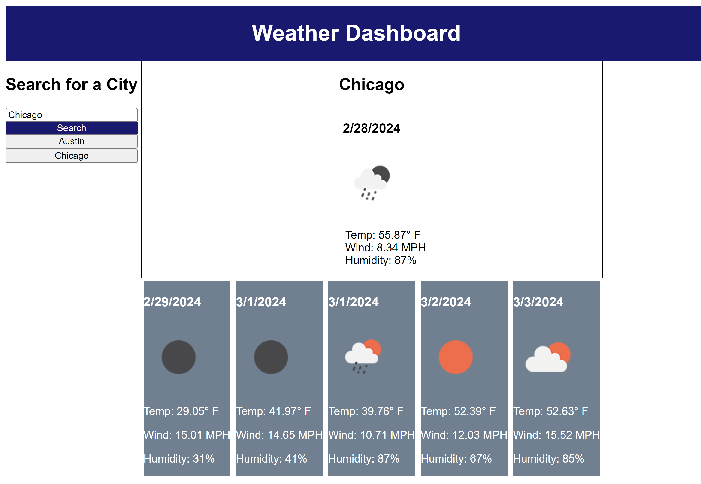

# Weather Dashboard 

## Description

This project for challenge 6 of the UT Austin Full-stack coding bootcamp provided the opportunity to practice fetching API data and saving/rendering information from local storage. It allows the user to render weather information from searched cities using a weather API, and previously searched cities are populated to the screen.

## Usage

To use the application, search for a city name to see its weather populate on the screen.
The website can be accessed at the following URL: https://victoria-cg.github.io/Weather-Dashboard/

   

## Credits

Resources:

Tutorial for storing and retrieving an array from local storage:

Kirupa. (2012, November 5). Storing and Retrieving an Array from Local Storage | kirupa.com. KIRUPA. Retrieved February 27, 2024, from https://www.kirupa.com/html5/storing_and_retrieving_an_array_from_local_storage.htm

Stack Overflow Tutorial on Persisting information from local storage:

How to save data to local storage and then have it persist on page reload, i have added a local storage function but it doesnt seem to work. (2022, August 31). Stack Overflow. Retrieved February 27, 2024, from https://stackoverflow.com/questions/73557029/how-to-save-data-to-local-storage-and-then-have-it-persist-on-page-reload-i-hav

Tutorial for formatting dates:

How to convert a full date to a short date in javascript? (2010, January 10). Stack Overflow. Retrieved February 27, 2024, from https://stackoverflow.com/questions/2035699/how-to-convert-a-full-date-to-a-short-date-in-javascript

README template: 

EdX. (2023, November 14). Professional README Guide | The Full-Stack Blog. GitHub Pages. Retrieved February 25, 2024, from https://coding-boot-camp.github.io/full-stack/github/professional-readme-guide

Collaboration/Assistance:

Tutoring with Alexis Gonzalez: 
-use of and syntax dynamically insert data, debugging
-order and syntax of functions to set, parse, and push local storage items
-use of card to display information
-changed html div classes to IDs for easier JS manipulation
-clearing weather text on cards/forecast with an empty string: debugging to clear previous forecast on refresh

Office Hours with Walter Perry:
-Assistance with order of API calls and how to find the information on the weather API for coding the icons to display the forecast.
-Assisted with debugging attempts for API call on stored city names/buttons

Ask BCS tutor:
-Helped with debugging syntax for appending information accurately from an array returned by API for weather data
-Helped with debugging rendering of functions for setting to storage/retrieving storage

AI Xpert:

-Helped with debugging function scope with regard to items inside for loop not functioning as intended

## License

See MIT license in the repository section titled "license".