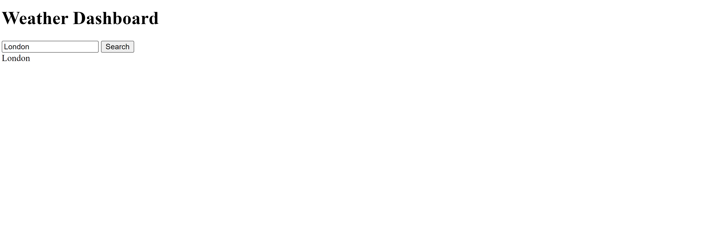

# Weather Dashboard 

## Description

This project for challenge 6 of the UT Austin Full-stack coding bootcamp provided the opportunity to practice fetching API data and saving/rendering information from local storage. Once complete, the app will allow users to search for a city and see current and 5 day forecasted weather conditions. 

## Usage

To use the application, search for a city name to see it populate on the screen. Once more features are completed the search results will also return weather forecast information.
The website can be accessed at the following URL: https://victoria-cg.github.io/Weather-Dashboard/

   

## Credits

README template: https://coding-boot-camp.github.io/full-stack/github/professional-readme-guide

Collaboration/Assistance:

Tutoring with Alexis Gonzalez: 
-use of and syntax for use of template literals to dynamically insert data
-order and syntax of functions to set, parse, and push local storage items
-use of card to display information
-changed html div classes to IDs for easier JS manipulation

Office Hours with Walter Perry:
-Assistance with order of API calls and how to find the information on the weathe API for coding the icons to display the forecast.

Ask BCS:
Helped with debugging syntax for appending accurately from an array returned by API for weather data

AI Xpert:

Helped with debugging function scope with regard to items inside for loop not functioning as intended

## License

See MIT license in the repository section titled "license".